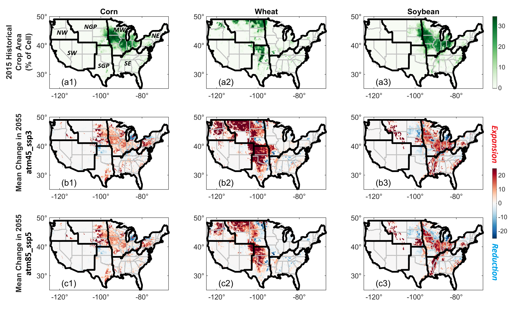
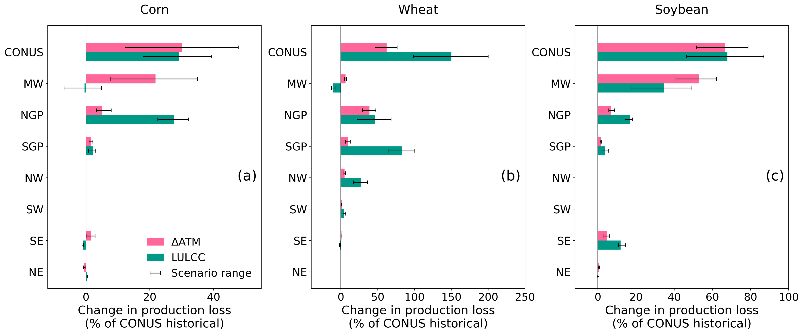
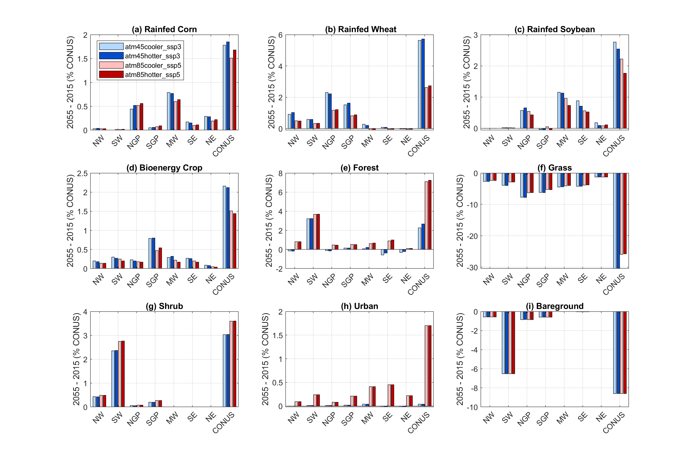
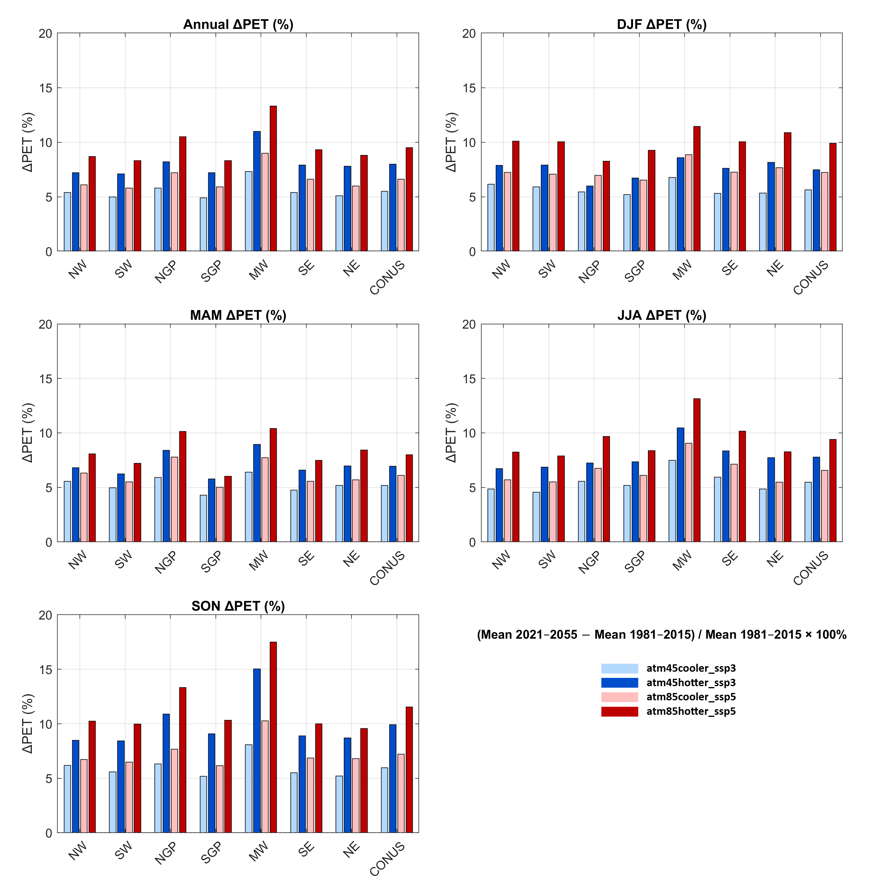
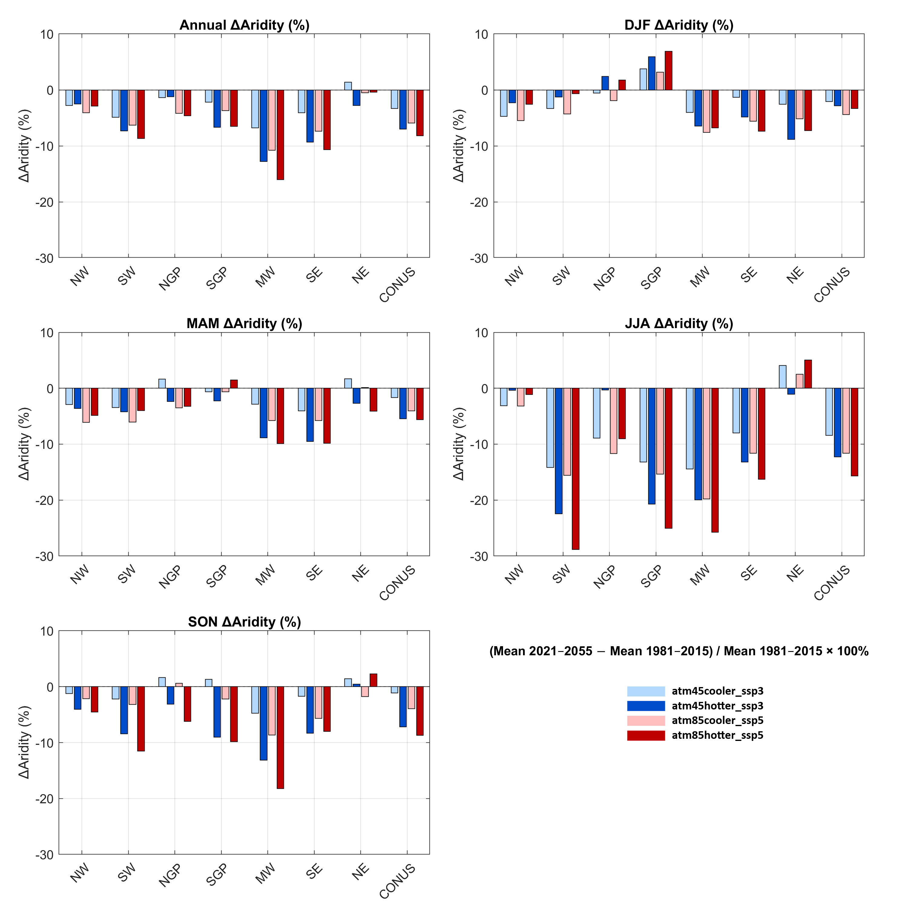
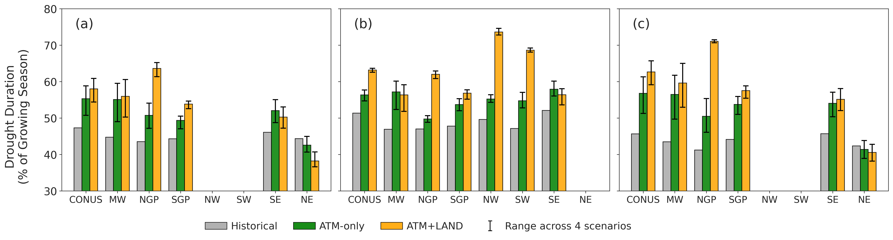
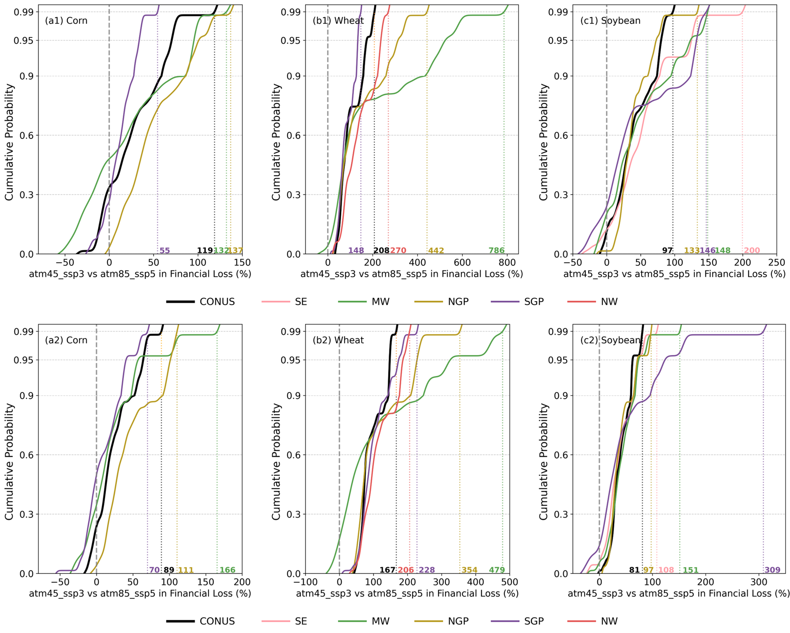

<!---->

# yao-etal\_2026\_communications-earth-environment

**Coupled Atmospheric and Land-use Shifts Amplify Drought-driven Crop Losses Across the Contiguous United States**

Lili Yao1*, Hongxiang Yan1, Ning Sun1, Eva Sinha1, Kanishka B. Narayan1, Travis B. Thurber1, and Jennie Rice1

1  Pacific Northwest National Laboratory, Richland, WA, USA
 

\* Correspondence: Lili Yao, lili.yao@pnnl.gov; Ning Sun, ning.sun@pnnl.gov

## Abstract
Agricultural drought (AD) poses a major threat to food security, yet its future risk remains uncertain under co-evolving atmospheric conditions and land-use trajectories. Using an integrated, multi-sector modeling framework, we project AD risks for major crops across the contiguous United States (CONUS) through 2055 under a range of plausible futures that capture thermodynamic changes and land-use and land-cover change (LULCC) trajectories. Model projections reveal that drought-driven crop production losses increase sharply by nearly 60% for corn, 250% for wheat, and 135% for soybean relative to historical levels. The primary drivers of these increases, which include atmospheric shifts and LULCC, vary by region and crop type.  LULCC acting as an important risk amplifier in regions experiencing cropland expansion into drought-prone regions, such as the Great Plains and northwestern U.S. Wheat exhibits the largest projected loss increases, a result that remains robust across scenarios. These findings highlight that interactions between atmospheric conditions and land-use trajectories shape future agricultural drought risk and should be jointly considered to support effective adaptation and food-system planning.

## Journal reference
Coupled Atmospheric and Land-use Shifts Amplify Drought-driven Crop Losses Across the Contiguous United States. Submitted to Communications Earth & Environment– January 2026.

## Data Reference

### Input Data
|       Dataset       |               URL                |               DOI                |
|:-------------------:|:--------------------------------------------:|:--------------------------------:|
| TGW-WRF | https://tgw-data.msdlive.org/ | https://doi.org/10.1038/s41597-023-02485-5, https://doi.org/10.57931/1885756 |
| GCAM-SELECT-Demeter | https://data.msdlive.org/records/vy529-6eg15 | https://doi.org/10.57931/2502083 |

### Output Data
| Dataset | URL | DOI |
|:-------:|:---:|:---:|
| CLM5 soil moisture and crop yield simulations | tbd | tbd |

### Contributing Modeling Software
| Model | Version | URL | DOI |
|:-----:|:-------:|:---:|:---:|
| CLM5  |  ctsm5.1.dev118 | https://github.com/IMMM-SFA/im3-clm | https://zenodo.org/records/6653705 |
| IM3 Components | 0cf45e8 | https://github.com/IMMM-SFA/im3components/tree/main/im3components/wrf\_to\_clm | |

## Reproduce my experiment

Clone the [CLM5 repository](https://github.com/ESCOMP/CTSM/tree/ctsm5.1.dev118) to set up the CLM5 model. You will need to download the [TGW forcing data](https://data.msdlive.org/records/ksw6r-2xv06) and convert them into CLM input format using these [scripts](https://github.com/IMMM-SFA/im3components/tree/main/im3components/wrf\_to\_clm). You will also need to replace the default CLM surface and landuse timeseries files using data from the [GCAM-SELECT-Demeter](https://data.msdlive.org/records/vy529-6eg15). In addition, hydrological parameter values in the default parameter file and the user name list file should be updated based the [behavioral parameter values](https://data.msdlive.org/records/41bw1-3q739). The [output data repository](TBD) already contains the ensemble output from the CLM5 model so you can skip rerunning the CLM5 model if you want to save time.

## Reproduce my figures
Use the scripts found in the `figures` directory to reproduce the figures used in this publication.

| Figure Numbers | Script Name | Description | Figure |
|:--------------:|:-----------:|:-----------:|:------:|
| 1  | [Figure_1.m](./figures/Figure_1.m) | Rainfed crop planting areas changes |  |
| 2  | [Figure_2.py](./figures/Figure_2.py) | Drought exposure and intensity  |  |
| 3  | [Figure_3.py](./figures/Figure_3.m) | Mean projected changes in production loss |  |
| 4  | [Figure_4.py](./figures/Figure_4.m) | Scenario and ESM variant uncertainty in projection |  |
| 5  | [Figure_5.py](./figures/Figure_5.m) | Relative differences in financial loss between scenarios |  |
| 6  | [Figure_6.py](./figures/Figure_6.m) | Validation of CLM’s performance |  |
| S1  | [Figure_S1.m](./figures/Figure_S1.m) | Projected changes for nine land use and land cover types |  |
| S2  | [Figure_S2.m](./figures/Figure_S2.m) | Projected changes in annual and seasonal air temperature |  |
| S3  | [Figure_S3.m](./figures/Figure_S3.m) | Projected changes in annual and seasonal precipitation |  |
| S4  | [Figure_S4.m](./figures/Figure_S4.m) | Projected changes in annual and seasonal potential evapotranspiration |  |
| S5  | [Figure_S5.m](./figures/Figure_S5.m) | Projected changes in annual and seasonal aridity index |  |
| S6  | [Figure_S6.py](./figures/Figure_S6.py) | Agricultural drought duration under historical and future scenarios |  |
| S7  | [Figure_S7.py](./figures/Figure_S7.py) | Relative differences in financial loss for cooler and hotter variants |  |
| S8  | [Figure_S8.py](./figures/Figure_S8.py) | Ratio of crop prices between scenarios |  |

